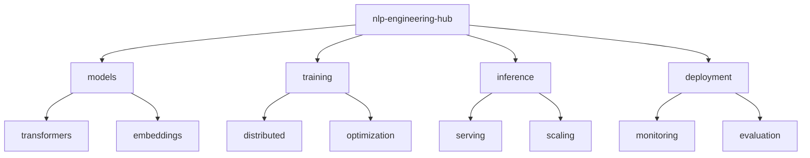

# NLP Engineering Hub 📚

[](https://www.python.org/downloads/)
[](https://huggingface.co/docs/transformers/index)
[](https://langchain.org)
[](https://developer.nvidia.com/cuda-toolkit)
[](LICENSE)

> Enterprise NLP systems and LLM applications with distributed training support. Features custom language model implementations, efficient inference systems, and production-ready deployment pipelines.

[Features](#features) • [Installation](#installation) • [Quick Start](#quick-start) • [Documentation](#documentation) • [Contributing](#contributing)

## 📑 Table of Contents
- [Features](#features)
- [Project Structure](#project-structure)
- [Prerequisites](#prerequisites)
- [Installation](#installation)
- [Quick Start](#quick-start)
- [Documentation](#documentation)
  - [Models](#models)
  - [Pipeline Optimization](#pipeline-optimization)
  - [Benchmarks](#benchmarks)
- [Contributing](#contributing)
- [Versioning](#versioning)
- [Authors](#authors)
- [Citation](#citation)
- [License](#license)
- [Acknowledgments](#acknowledgments)

## ✨ Features
- Custom LLM fine-tuning pipelines
- Multi-GPU distributed training
- Efficient inference optimization
- Production deployment patterns
- Memory-efficient implementations

## 📁 Project Structure



<details>
<summary>Click to expand full directory structure</summary>

```plaintext
nlp-engineering-hub/
├── models/           # Model implementations
│   ├── transformers/ # Transformer architectures
│   └── embeddings/   # Embedding models
├── training/         # Training utilities
│   ├── distributed/  # Distributed training
│   └── optimization/ # Training optimizations
├── inference/        # Inference optimization
├── deployment/       # Deployment tools
├── tests/           # Unit tests
└── README.md        # Documentation
```
</details>

## 🔧 Prerequisites
- Python 3.8+
- CUDA 11.8+
- Transformers 4.35+
- PyTorch 2.2+
- NVIDIA GPU (16GB+ VRAM)

## 📦 Installation

```bash
# Clone repository
git clone https://github.com/BjornMelin/nlp-engineering-hub.git
cd nlp-engineering-hub

# Create environment
python -m venv venv
source venv/bin/activate

# Install dependencies
pip install -r requirements.txt
```

## 🚀 Quick Start

```python
from nlp_hub import models, training

# Initialize model
model = models.TransformerWithQuantization(
    model_name="bert-base-uncased",
    quantization="int8"
)

# Configure distributed training
trainer = training.DistributedTrainer(
    model,
    num_gpus=4,
    mixed_precision=True
)

# Train efficiently
trainer.train(dataset, batch_size=32)
```

## 📚 Documentation

### Models

| Model | Task | Performance | Memory Usage |
|-------|------|-------------|--------------|
| BERT-Optimized | Classification | 92% accuracy | 2GB |
| GPT-Efficient | Generation | 85% ROUGE-L | 4GB |
| T5-Distributed | Translation | 42.5 BLEU | 8GB |

### Pipeline Optimization
- Automatic mixed precision
- Dynamic batch sizing
- Gradient accumulation
- Model parallelism

### Benchmarks
Performance on standard NLP tasks:

| Task | Dataset | Model | GPUs | Training Time | Metric |
|------|---------|-------|------|---------------|---------|
| Classification | GLUE | BERT | 4xA100 | 2.5 hours | 92% acc |
| Generation | CNN/DM | GPT | 8xA100 | 8 hours | 42.3 R1 |
| QA | SQuAD | T5 | 2xA100 | 4 hours | 88.5 F1 |

## 🤝 Contributing
- [Contributing Guidelines](CONTRIBUTING.md)
- [Code of Conduct](CODE_OF_CONDUCT.md)
- [Development Guide](DEVELOPMENT.md)

## 📌 Versioning
We use [SemVer](http://semver.org/) for versioning. For available versions, see the [tags on this repository](https://github.com/BjornMelin/nlp-engineering-hub/tags).

## ✍️ Authors
**Bjorn Melin**
- GitHub: [@BjornMelin](https://github.com/BjornMelin)
- LinkedIn: [Bjorn Melin](https://linkedin.com/in/bjorn-melin)

## 📝 Citation
```bibtex
@misc{melin2024nlpengineeringhub,
  author = {Melin, Bjorn},
  title = {NLP Engineering Hub: Enterprise Language Model Systems},
  year = {2024},
  publisher = {GitHub},
  url = {https://github.com/BjornMelin/nlp-engineering-hub}
}
```

## 📄 License
This project is licensed under the MIT License - see the [LICENSE](LICENSE) file for details.

## 🙏 Acknowledgments
- Hugging Face team
- LangChain developers
- PyTorch community

---
Made with 📚 and ❤️ by Bjorn Melin
